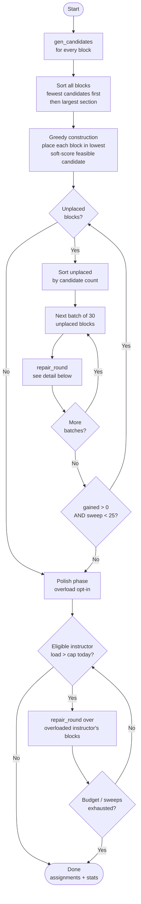

# Kairos — UCTP Optimization Model

A formal description of the University Course Timetabling (UCTP) model implemented in
`src/timetabling/`. This is the ground-truth specification: it mirrors `model_cpsat.py`
(the declarative CP-SAT model), `repair.py` (the production solver), `config.py`
(the tunable defaults), and `settings.py` (the per-school overrides exposed in the UI's
School Settings step). When the code and this document disagree, the code wins — update
this file.

The solver decides, for each undergraduate course **block**, a **(room, day, start-hour)**.
Section / instructor / size / T-P-L are fixed inputs; the only decisions are **time** and
**room**.

---

## 0. Scheduling constraints at a glance

A plain-language checklist of every rule the schedule obeys. Sections 3–6 give the formal
CP-SAT encoding; this list is the human-readable summary. Each item notes whether it is a
**hard** rule (can never be violated) or a **soft** preference (penalized, never blocking),
and where it lives (pruning, model relation, or objective).

### What is fixed vs. decided

- **Fixed inputs:** each section's instructor(s), enrolled size, and T/P/L hours.
- **Decided:** for every block of every section, a `(room, day, start-hour)`.
- A section is split into **blocks**: theory hours `T+P` into sessions of at most 2 h (e.g.
  `T=3 → 2+1`), plus one lab block of `L` hours (split at 4 h). Each block is placed once.

### Hard constraints — enforced by candidate pruning (per block)

A placement that breaks one of these is never even generated, so it cannot occur.

- **Capacity** — a block goes only in a room whose capacity ≥ the section's size. The virtual
  `Online` room is exempt (unlimited).
- **Lab-room pinning** — a lab block is pinned to the section's designated real lab room; it
  can go nowhere else. Labs with no designated lab room use regular rooms.
- **Daytime window** — an undergraduate block must end by **18:00** (start no earlier than
  09:00). Graduate blocks (if enabled) run 18:00–21:00.
- **Friday blackout** — nothing is scheduled into the **Friday 13:00–14:00** slot.
- **Seminar blackout** — nothing is scheduled into **Thursday 14:00–16:00** if any of the
  section's instructors is full-time staff.
- **Instructor availability** — a block is never placed in a half-day an instructor marked
  unavailable; every co-instructor's unavailability applies (a per-instructor blackout, set
  in the School Settings step).
- **Fixed session** — if a section declares a fixed slot, its **first block** is pinned to
  exactly that `(day, start-hour)` (its remaining blocks schedule freely).
- **Room type** — if a section declares it needs a lab room (the `Room Type` column), its
  blocks go only in lab-flagged rooms; otherwise any fitting room (today's behavior).

### Hard constraints — enforced as model relations (across blocks)

- **Exactly-one placement** — every block is scheduled exactly once. (In the `--repair`
  solver this is relaxed so a block may stay unplaced, yielding a partial schedule.)
- **Room no-overlap** — at most one block occupies a physical room in any hour. (The `Online`
  virtual room is exempt.)
- **Instructor no-overlap** — no instructor is double-booked in any hour; every co-instructor
  of a team-taught section counts.
- **Section self no-overlap** — two blocks of the same section never overlap in time.
- **Theory different-day** — a section's theory sessions each fall on a **different day**
  (a `2+1` split occupies two days). Lab blocks are exempt.

### Soft preferences — penalized in the objective (never block a schedule)

Listed heaviest weight first; weights live in `config.py`.

- **Avoid evenings** (`w_evening=10`) — penalize each teaching-hour at or after 17:00.
- **Cohort course-conflict** (`w_cohort_conflict=50`) — penalize each extra distinct course a
  `(dept, year)` cohort runs in the same slot. A *soft proxy* — a hard version was infeasible.
- **Compress instructor weeks** (`w_instr_days=3` full-time, `w_parttime_days=5` part-time) —
  penalize each distinct day an instructor must come to campus; part-timers weigh more.
- **Cohort daily compactness** (`w_cohort_gap=3`) — penalize idle gaps within a year-2/3/4
  cohort's day.
- **Fewer rooms** (`w_room_count=2`) — penalize each physical room used at all (consolidate).
- **Level ordering** (`w_order=1`) — prefer low-level courses early, high-level courses late;
  level-1 and graduate excluded.
- **Engineering labs late-week** (`w_englab=1`) — prefer Engineering lab blocks on Thu/Fri.
- **Instructor daily overload** (`w_instr_daily_overload=0`, opt-in) — penalize teaching-hours
  beyond 4 h/day per instructor; only for instructors with ≤16 h/week total. Off by default
  because a hard daily cap is infeasible (service-course instructors carry >20 h/week).
- **Non-adjacent split** (`w_nonadjacent=0`, disabled) — superseded by the hard theory
  different-day rule.

### What "0 hard violations" means

`validate.py` independently re-checks: placement, capacity, lab-room, daytime window,
blackouts, room/instructor/self no-overlap, theory different-day, and the School-Settings
hard rules — **room-type** (lab requirement), **fixed** (pinned first block), and
**instructor-unavailable**. Cohort conflict and instructor overload are **soft metrics**,
never hard violations.

### Per-school configuration (School Settings)

Every value above is a default tuned to our own institution; the **School Settings** UI step
lets another school override them without touching code. A session **Settings** dict plus an
instructor-availability map are turned into a `Config` by `settings.build_config` at solve
time: the day window, blackout slots, Saturday / graduate toggles, block-split policy, the
instructor daily-hours cap, and the soft-preference weights (as off / normal / strong presets)
are all configurable; optional course-list columns (`Year`, `Part-time`, `Room Type`, `Fixed`)
override the string-derived cohort / part-time / lab / pin. Unconfigured settings reproduce the
defaults documented here exactly, so this section stays the ground truth for the out-of-the-box
behavior. A downloadable "school profile" JSON persists a school's settings + availability.

---

## 1. Sets and indices

| Symbol | Meaning | Source |
|---|---|---|
| $S$ | sections (one cohort offering of a course) | `derive.build_sections` |
| $B$ | blocks; each section contributes one or more | `derive.blocks_from_tpl` |
| $B_s \subseteq B$ | blocks of section $s$ | |
| $R$ | rooms, physical $R_{\text{phys}}$ plus virtual ($\texttt{Online}$) | `classrooms.csv`, `route.mark_virtual` |
| $I$ | instructors (a section may have several — team teaching) | `lecturers.csv` |
| $I_b \subseteq I$ | instructors of the section owning block $b$ | |
| $D$ | days $\{\mathrm{Mo,Tu,We,Th,Fr}\}$ (Sa optional) | `Config.days()` |
| $H$ | hour-slots, $9 \le h < 21$ | `horizon_start`, `horizon_end` |
| $K$ | cohorts $k=(\text{dept code},\ \text{year level})$ | `Section.cohort_key` |
| $\mathcal{C}(b)$ | legal candidate placements $(r,d,h)$ of block $b$ | `gen_candidates` |

**Blocks** are derived from a section's T/P/L hours:

- Theory hours $T+P$ split into sessions of at most `max_theory_session` $=2$ h (e.g.
  $T{=}3 \to 2+1$), each forced onto a different day.
- One lab block of $L$ hours, split at `max_block_len` $=4$ h, pinned to the section's
  real lab room.
- Block ids: single `#T` / `#L`; split `#T1..#Tk` / `#L1..#Lk`. Kind detected by
  `"#L" in block_id`; `section_id = block_id.split("#")[0]`.

---

## 2. Parameters

| Symbol | Meaning | Default | Knob |
|---|---|---|---|
| $\mathrm{cap}_r$ | capacity of room $r$ | — | `classrooms.csv` |
| $n_s$ | students in section $s$ | — | enrollment |
| $\ell_b$ | length of block $b$ (hours) | — | T/P/L |
| $\mathrm{lvl}_s$ | course level of section $s$ ($1\dots4$) | — | course code |
| $C$ | daily teaching-hours cap | $4$ | `max_instr_daily_hours` |
| $W$ | weekly-load exemption threshold | $16$ | `overload_exempt_weekly` |
| — | undergrad end-of-day | 18:00 | `undergrad_end` |
| — | evening threshold | 17:00 | `evening_from_hour` |
| — | Friday blackout | 13–14 | `friday_blackout` |
| — | seminar blackout (full-time only) | Th 14–16 | `seminar_blackout` |
| — | AM/PM split for half-day availability | 13:00 | `midday_split_hour` |
| — | per-instructor unavailable slots | — | `instr_unavailable` (School Settings) |

---

## 3. Decision variables

| Symbol | Domain | Meaning |
|---|---|---|
| $x_{b,r,d,h}$ | $\{0,1\}$ | $=1$ iff block $b$ occupies room $r$, day $d$, starting at hour $h$ |

- A variable is created **only for legal candidates** $(r,d,h)\in\mathcal{C}(b)$ — see the
  pruning note below. The full index product is never materialized.
- Auxiliary variables used by the objective and the different-day rule are derived from
  $x$: day-activity $z_{s,b,d}=\max_{r,h}x_{b,r,d,h}$, room-used, instructor-day indicators,
  cohort slot-busy / first / last, and overload integers $o_{i,d}$.

**Candidate pruning (key design decision).** Per-block hard rules are enforced by *not
creating* the variable rather than by adding a model row. `gen_candidates` emits
$(r,d,h)$ only when it already satisfies:

- room capacity $\mathrm{cap}_r \ge n_s$ (the virtual `Online` room is exempt — unlimited);
- lab-room pinning — a lab block only in the section's designated lab room;
- undergrad window $h + \ell_b \le 18$;
- Friday 13–14 and Thursday 14–16 (seminar, full-time only) blackouts;
- per-instructor availability (`Config.instr_unavailable`) — a candidate is dropped if any of
  the section's instructors is marked unavailable over its span;
- fixed-slot pin — a section's first block is restricted to its declared `(day, start)`;
- room-type — when a section requires a lab room, only lab-flagged rooms are emitted.

Best-fit additionally caps each block to the `max_rooms_per_block` smallest fitting rooms.

---

## 4. Hard constraints

Listed one per block. Each is a model relation; the per-block rules folded into pruning
(capacity, lab-room, window, blackout) are **not** repeated here.

### H1 — placement (exactly one)

$$
\sum_{(r,d,h)\,\in\,\mathcal{C}(b)} x_{b,r,d,h} \;=\; 1 \qquad \forall\, b \in B
$$

- Every block is scheduled exactly once, into one of its legal candidates.
- Because the sum is over $\mathcal{C}(b)$ only, an infeasible placement is unreachable.
- In `repair` this is **soft** (a block may stay unplaced) so a partial schedule always
  exists; in `model_cpsat` it is hard.

### H2 — room no-overlap

$$
\sum_{\substack{b,\,h' \,:\, h\,\in\,[h',\,h'+\ell_b)}} x_{b,r,d,h'} \;\le\; 1
\qquad \forall\, r \in R_{\text{phys}},\; d,\; h
$$

- At most one block occupies a physical room during any hour-slot.
- The inner condition $h\in[h',h'+\ell_b)$ expands a block over every hour it spans.
- The virtual `Online` room is excluded from $R_{\text{phys}}$ — it has unlimited capacity
  and is exempt from this constraint.

### H3 — instructor no-overlap

$$
\sum_{\substack{b \,:\, i \in I_b}}\ \sum_{\substack{h' \,:\, h\,\in\,[h',\,h'+\ell_b)}} x_{b,\cdot,d,h'} \;\le\; 1
\qquad \forall\, i \in I,\; d,\; h
$$

- No instructor is double-booked in any hour-slot.
- A team-taught section enters the sum of **every** co-instructor.

### H_self — intra-section no-overlap

$$
\sum_{\substack{b \in B_s,\, h' \,:\, h\,\in\,[h',\,h'+\ell_b)}} x_{b,\cdot,d,h'} \;\le\; 1
\qquad \forall\, s \in S,\; d,\; h
$$

- Distinct blocks of the same section never overlap (a student in the section could not
  attend both).
- Same shape as H3 but grouped by section instead of instructor.

### H_day — theory different-day

$$
\sum_{b \,\in\, B_s^{\text{theory}}} z_{s,b,d} \;\le\; 1
\qquad \forall\, s \in S,\; d \in D,
\qquad z_{s,b,d} = \max_{r,h} x_{b,r,d,h}
$$

- A section's theory sessions each fall on a **different day** (e.g. a $2+1$ split occupies
  two days, not one).
- Hard in **both** `model_cpsat` and `repair`; re-checked as `split_day` in `validate`.
- Lab blocks are excluded (the rule keys on $b\in B_s^{\text{theory}}$).

> **Cohort overlap is deliberately not a hard constraint.** A hard course-level cohort
> rule was proven infeasible at scale, so it is a *soft* term (§5.7). "0 hard violations"
> therefore means H2, H3, H_self, H_day plus the pruned rules (capacity, lab-room, window,
> blackout) all hold.

---

## 5. Soft objective

Minimize a weighted sum of penalties. Every preference is soft, so none can cause
infeasibility. Weights live in `config.py`.

$$
\min \;\; \sum_{t} w_t \cdot \mathrm{pen}_t
$$

The terms, stacked:

### 5.1 S-Evening — $w_{\text{evening}}=10$

$$
\mathrm{pen}_{\text{eve}} \;=\; \sum_{b,r,d}\ \sum_{\substack{h \in \text{span}(b,h')\\ h \,\ge\, 17}} x_{b,r,d,h'}
$$

- One unit of penalty for each scheduled hour at or after `evening_from_hour` $=17$.
- Pushes undergraduate teaching into daytime slots.

### 5.2 Room count — $w_{\text{room}}=2$

$$
\mathrm{pen}_{\text{room}} \;=\; \sum_{r \in R_{\text{phys}}} y_r,
\qquad y_r = \big[\, \textstyle\sum x_{\cdot,r,\cdot,\cdot} \ge 1 \,\big]
$$

- One unit per physical room that is used at all → consolidate into fewer rooms.

### 5.3 Instructor-days — $w_{\text{instr}}=3$ (full-time), $w_{\text{pt}}=5$ (part-time)

$$
\mathrm{pen}_{\text{days}} \;=\; \sum_{i,d} w_i\, \delta_{i,d},
\qquad \delta_{i,d} = \big[\, i \text{ teaches on day } d \,\big]
$$

- One unit per distinct day an instructor teaches → compress each instructor's week.
- Part-time staff carry the heavier weight (fewer trips to campus).
- This term pushes **toward** packed days — directly in tension with the overload term
  (§6), which the weights balance.

### 5.4 Cohort-gap — $w_{\text{gap}}=3$

$$
\mathrm{gap}_{k,d} \;\ge\; \mathrm{last}_{k,d} - \mathrm{first}_{k,d} - \mathrm{load}_{k,d},
\qquad \mathrm{pen}_{\text{gap}} = \sum_{k,d} \mathrm{gap}_{k,d}
$$

- Penalizes idle gaps inside a cohort's day: span (last $-$ first) minus busy hours.
- Applies to cohorts of year level $\in\{2,3,4\}$ (`compact_cohort_years`).
- $\mathrm{first}/\mathrm{last}$ are min/max active hour of the cohort that day.

### 5.5 S-Order — $w_{\text{order}}=1$

$$
\mathrm{pen}_{\text{order}} \;=\; \sum_{b,r,d,h} w_{\text{order}}\,(4-\mathrm{lvl}_s)\,(h-9)\; x_{b,r,d,h}
\qquad (\,2 \le \mathrm{lvl}_s \le 4\,)
$$

- Encourages low-level courses early and high-level courses late in the day.
- Coefficient grows with start hour and with how low the level is; level-1 and graduate
  excluded.

### 5.6 S-EngLab — $w_{\text{englab}}=1$

$$
\mathrm{pen}_{\text{englab}} \;=\; \sum_{\substack{b \text{ Eng. lab}\\ (r,d,h):\, d \notin \{\mathrm{Th,Fr}\}}} x_{b,r,d,h}
$$

- One unit per Engineering **lab** block placed off Thursday/Friday (`eng_lab_days`).
- Matches sections whose faculty contains `eng_faculty_match` $=$ "Engineering".

### 5.7 Cohort-conflict — $w_{\text{coh}}=50$

$$
\mathrm{excess}_{k,d,h} \;\ge\; \Big(\textstyle\sum_{c} \mathrm{busy}_{k,c,d,h}\Big) - 1,
\qquad \mathrm{pen}_{\text{coh}} = \sum_{k,d,h} \mathrm{excess}_{k,d,h}
$$

- For each cohort-slot, penalizes every **distinct course** busy beyond the first
  ($\mathrm{busy}_{k,c,d,h}=\max x$ over that course's blocks in the slot).
- A *soft* proxy: $(\text{dept},\text{year})$ over-counts conflict because students split
  across electives, so a hard rule was infeasible. High weight (50) but not prohibitive.
- Reported as `cohort_conflicts`; **never** a `Violation` in `validate`.

### 5.8 Non-adjacent split — $w_{\text{nonadj}}=0$ (disabled)

- Would penalize a section's split blocks sharing a day; **superseded** for theory by the
  hard different-day rule (H_day), so the weight is $0$.

### 5.9 Instructor daily overload — $w_{\text{overload}}=0$ (opt-in)

- See §6.

---

## 6. Instructor daily overload (soft, opt-in)

Penalizes each teaching-hour beyond the daily cap $C$, per instructor, per day.

$$
\mathrm{load}_{i,d} \;=\; \sum_{b \,:\, i \in I_b} \ell_b \cdot z_{\cdot,b,d},
\qquad
o_{i,d} \;\ge\; \mathrm{load}_{i,d} - C, \quad o_{i,d} \ge 0,
\qquad
\mathrm{pen}_{\text{over}} = \sum_{i \in \mathcal{E},\, d} o_{i,d}
$$

- $o_{i,d}$ is the hours over the cap on that day; only positive overflow is charged.
- The objective gains $w_{\text{overload}}\sum o_{i,d}$.

**Why soft, not hard.**

- A hard $\mathrm{load}_{i,d}\le C$ is **infeasible**: in period 001, ~19 instructors carry
  $>20$ h/week (service courses) and cannot fit five weekdays at 4 h.
- As a soft term it never blocks a schedule; it just biases days apart where possible.
- In the `model_cpsat` solve the term enters `Minimize` directly; in the `--repair` solver
  it is realized as overload-aware greedy construction plus a polish pass (see §7b).

**Weekly-load exemption set $\mathcal{E}$.**

$$
\mathcal{E} \;=\; \Big\{\, i \;:\; \sum_{s \,:\, i \in I_s}\ \sum_{b \in B_s} \ell_b \;\le\; W \,\Big\}
$$

- The penalty applies **only** to instructors with total weekly load $\le W$
  (`overload_exempt_weekly` $=16$).
- High-load instructors (e.g. Basic Sciences service teaching) are exempt: a 4 h/day
  target is unreachable for them, and penalizing them only distorts placement without
  helping. With $W=0$ the exemption is off (penalize everyone).
- Helpers: `model.weekly_load_hours`, `model.overload_eligible_ids`.

**CLI.** `--instr-overload-weight`, `--instr-daily-cap`, `--overload-exempt-weekly`.

---

## 7. Solution methods

Both solvers share the same candidate generation and constraints.

**(a) Monolithic — `model_cpsat.build_and_solve`.**

- Builds the full model above and calls CP-SAT once.
- Used for **scoped** runs (a faculty/department, Mode A/B benchmarking).
- A single *global* solve (~356 k variables) returns **UNKNOWN** — it does not scale to the
  full period, which is why (b) exists.

**(b) Repair — `repair.solve_repair` (`--repair`, production).**

1. **Greedy construction (soft-shaping)** — place each block in its **lowest soft-score**
   feasible candidate (ties broken by candidate order = best-fit room). The unified score is
   `w_evening·evening_hours + w_cohort_conflict·new_cohort_conflicts + w_instr_overload·overload_added`.
   Evening + cohort-conflict are **on by default** (`soft_shaping_in_repair=True`,
   `--no-soft-shaping` to disable); overload is opt-in via its own weight. This construction
   shaping is the main lever for soft quality — far more effective than post-hoc polish, which
   has little maneuvering room. `new_cohort_conflicts` is myopic (sees only already-placed
   blocks), so the reduction is partial but cheap and placement-safe.
2. **Warm-started small-neighbourhood repair** — repeatedly free a small batch of unplaced
   blocks plus their competitors and re-solve that neighbourhood with CP-SAT (soft H1,
   warm-started from the current placement); frozen blocks stay as reservations. Loop until
   no gains. The overload term is **not** added here, so the placement objective stays pure.
3. **Polish (overload only)** — once placement converges, re-optimize the days of
   overloaded *eligible* instructors over already-placed blocks; the repair round's accept
   guard never lowers placement within a neighbourhood. Bounded by `POLISH_SWEEPS`,
   `POLISH_TL`, `POLISH_BUDGET_S`. Post-hoc polish has little maneuvering room (most blocks
   are frozen), so it is a cheap secondary cleanup — the construction shaping in step 1 does
   the bulk of the work.

**Repair solver — top-level flow**

**repair\_round — neighbourhood sub-solver**

Full-period result (overload off): 001 ≈ 91.7 % placed, 002 ≈ 88.6 %, both at **0 hard
conflicts**. A ~8–11 % tail (Architecture studios) remains.

**Measured effect of the overload penalty** (period 001, $w_{\text{overload}}=30$, two
baselines for the noise band):

| metric | baseline | overload on |
|---|---|---|
| placed assignments | 1585–1588 | ~1570 (≈ 1 % fewer) |
| eligible instructors with a day $>4$ h | ~50 | ~28 (≈ −45 %) |
| eligible overload-hours | ~100 | ~47 (≈ −54 %) |

The penalty is **opt-in** (`w_instr_daily_overload=0` by default), so the default schedule
is the baseline. Enabling it trades roughly **1 % placement** for a large drop in eligible
instructors teaching more than the cap. Exempt (high-load) instructors are unchanged by
design — the worst single day stays at 9 h.

**Measured effect of soft-shaping** (period 001, evening + cohort-conflict, **on by default**,
two `--no-soft-shaping` baselines for the noise band):

| metric | baseline (off) | shaping on |
|---|---|---|
| placed assignments | 1581–1584 | 1602 (no loss — slightly higher) |
| evening ratio | ~19.4 % | 12.6 % (≈ −35 %) |
| cohort-conflict (proxy) | ~540–575 | 384 (≈ −31 %) |

Unlike the overload penalty, soft-shaping costs **no placement** (spreading cohorts and
avoiding evenings also distributes load and improves packing). Both student-facing metrics
drop by roughly a third versus the manual program's far worse 32.5 % evening / 139
cohort-conflicts (and 0 hard violations vs the program's 83).

---

## 8. Validation (independent)

`validate.py` re-derives every hard violation directly from the assignment list, importing
no solver internals, so a model/encoding bug cannot pass silently. It checks: room,
instructor, capacity, **lab_room**, window ($<$ 18:00), blackout, H_self, and **split_day**
(theory different-day). Cohort conflict and instructor overload are **soft metrics**, not
`Violation`s — reported in `mode_b_<period>.json` / `unmet_soft`, never failing validation.
