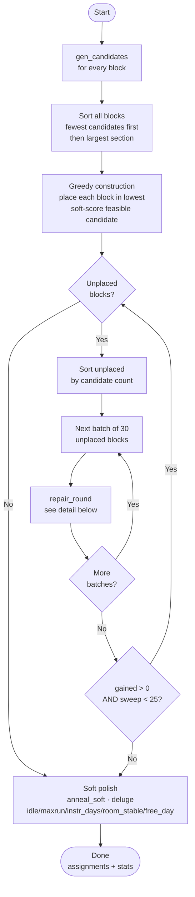
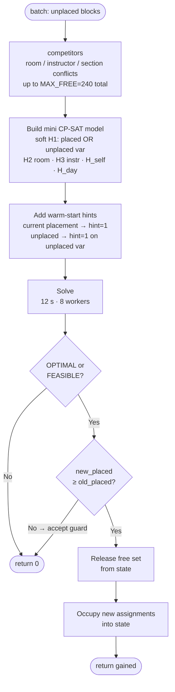

# KAIROS — UCTP Optimization Model

A formal description of the University Course Timetabling (UCTP) model implemented in
`src/timetabling/`. This is the ground-truth specification: it mirrors `model_cpsat.py`
(the declarative CP-SAT model), `repair.py` (the production solver), `config.py`
(the tunable defaults), and `settings.py` (the per-school overrides exposed in the UI's
School Settings step). When the code and this document disagree, the code wins — update
this file.

The solver decides, for each undergraduate course **block**, a **(room, day, start-hour)**.
Section / instructor / size / T-P-L are fixed inputs; the only decisions are **time** and
**room**.

---

## 0. Scheduling constraints at a glance

A plain-language checklist of every rule the schedule obeys. Sections 3–6 give the formal
CP-SAT encoding; this list is the human-readable summary. Each item notes whether it is a
**hard** rule (can never be violated) or a **soft** preference (penalized, never blocking),
and where it lives (pruning, model relation, or objective).

### What is fixed vs. decided

- **Fixed inputs:** each section's instructor(s), Section Capacity (quota), and T/P/L hours.
- **Decided:** for every block of every section, a `(room, day, start-hour)`.
- A section is split into **blocks**: theory hours `T+P` into sessions of at most `max_theory_session` h
  (default 2; e.g. `T=3 → 2+1`), plus one lab block of `L` hours (split when `L > max_block_len`,
  default 4). Each block is placed once. Both thresholds are tunable via School Settings.

### Hard constraints — enforced by candidate pruning (per block)

A placement that breaks one of these is never even generated, so it cannot occur.

- **Capacity** — a block goes only in a room whose capacity ≥ the section's size. The virtual
  `Online` room is exempt (unlimited).
- **Lab-room pinning / room segregation** — a lab block with a designated real lab room is
  pinned to that room only. A lab block without a pinned room goes to any lab-family room
  (`is_lab`). Theory/practice blocks are **excluded from lab-family rooms entirely** — they
  can only go in ordinary classrooms (`not is_lab`).
- **Daytime window** — an undergraduate block must end by the **Day end** hour (default
  **18:00**; tunable 13–21 in School Settings) and start no earlier than the **Day start**
  hour (default **09:00**; tunable 6–12). Graduate blocks (if enabled) end by **21:00**
  (fixed — `horizon_end` is not a settings field) and start no earlier than the configurable
  **Graduate earliest start** hour (default **18:00**; tunable 6–20 in School Settings).
- **Blackout slots** — closed `(day, hour)` slots are **school-specific and configurable**
  (none by default; add them in the School Settings step). Each slot has a scope: *everyone*
  (closed for all sections) or *full-time only* (closed only when a section has a full-time
  staff instructor — e.g. a faculty seminar). Common examples: a Friday 13:00–14:00
  congregational-prayer hour (everyone), or a Thursday 14:00–16:00 staff seminar
  (full-time only).
- **Instructor availability** — a block is never placed in any hour slot an instructor marked
  unavailable; every co-instructor's unavailability applies (a per-instructor blackout, set
  in the School Settings step). The availability grid is hourly.
- **Fixed session** — if a section declares a fixed slot, its **first block** is pinned to
  exactly that `(day, start-hour)` (its remaining blocks schedule freely).
- **Room type** — rooms carry a categorical type (`normal / lab / pc / studio`). When a section
  declares a `Room Type` demand, its blocks go only in rooms of that **exact** category
  (`pc`→`pc`, `studio`→`studio`, `lab`→`lab`); a generic lab demand falls back to any lab-family
  room (`is_lab`). With no explicit demand: lab blocks go to lab-family rooms only; theory
  blocks go to ordinary classrooms only (lab-family rooms are never eligible for theory).

### Hard constraints — enforced as model relations (across blocks)

- **Exactly-one placement** — every block is scheduled exactly once. (In the `--repair`
  solver this is relaxed so a block may stay unplaced, yielding a partial schedule.)
- **Room no-overlap** — at most one block occupies a physical room in any hour. (The `Online`
  virtual room is exempt.)
- **Instructor no-overlap** — no instructor is double-booked in any hour; every co-instructor
  of a team-taught section counts.
- **Section self no-overlap** — two blocks of the same section never overlap in time.
- **Theory different-day** — a section's theory sessions each fall on a **different day**.
  The number of sessions (and thus days) depends on `max_theory_session` (default 2 h,
  tunable via School Settings "Teori oturumu üst sınırı"); e.g. with default 2 h, `T=3 →
  2+1` across two days; with `max_theory_session=3`, `T=3` fits in one session (one day).
  Lab blocks are exempt.

### Soft preferences — penalized in the objective (never block a schedule)

Listed by default weight magnitude where that comparison is meaningful; weights live in
`config.py`, but `settings.build_config()` may zero or remap some UI-controlled terms at solve
time. The CP-SAT monolith (§7a) and the repair soft polish (§7b) use separate objectives — see
§5 for which terms belong to which path.

- **Cohort course-conflict** (`w_cohort_conflict=50`) — penalize each extra distinct course a
  `(dept, year)` cohort runs in the same slot (CP-SAT monolith objective; no-regress guard in
  repair polish). A *soft proxy* — a hard version was infeasible.
- **Student idle gaps** (`w_idle=15.0` repair / `w_cohort_gap=10.0` monolith) — penalize idle
  hours inside a cohort's day; always-on in the repair polish (fixed weight, not a UI dial).
- **Maxrun — anti-fatigue** (`w_maxrun=10.0`) — penalize consecutive teaching runs longer than
  `max_consecutive_hours`=3 h, over cohorts and instructors (repair polish).
- **Compress instructor weeks** (`w_instr_days=10.0` full-time, `w_parttime_days=14.0`
  part-time when an instructor-days target is active; repair polish uses `w_instr_days` only) —
  CP-SAT monolith penalizes every teaching day; repair polish penalizes days beyond
  `max_instr_days`. In the UI default (`instr_days_target = No target`) `build_config()` forces
  both weights to 0.0; choosing ≤4/≤3/≤2 activates the term and maps the priority preset to
  5.0/10.0/20.0, with part-time set to `w_instr_days + 4.0`.
- **Room stability** (`w_room_stable=10.0`) — penalize each section that uses more than one
  room across its blocks (repair polish).
- **Free day** (`w_free_day=10.0`, year-scoped) — penalize each configured year-level cohort
  that occupies all working days (repair polish). The UI does not expose a free-day weight dial;
  the year multiselect is the on/off scope control. With no selected years, the term is inert.
- **Level ordering** (`w_order=1`) — prefer low-level courses early, high-level courses late;
  level-1 and graduate excluded (CP-SAT monolith).
- **Engineering labs late-week** (`w_englab=1`) — prefer Engineering lab blocks on Thu/Fri
  (CP-SAT monolith).
- **Non-adjacent split** (`w_nonadjacent=0`, disabled) — superseded by the hard theory
  different-day rule.

### What "0 resource conflicts" means

`validate.py` independently re-checks: placement, capacity, lab-room, daytime window,
blackouts, room/instructor/self no-overlap, theory different-day, and the School-Settings
hard rules — **room-type** (lab requirement), **fixed** (pinned first block), and
**instructor-unavailable**. In benchmark summaries, "0 resource conflicts" excludes
`placement` violations caused by an unplaced tail; those are reported separately. Cohort
conflict is a **soft metric**, never a hard violation.

### Per-school configuration (School Settings)

Every value above is a default tuned to our own institution; the **School Settings** UI step
lets another school override them without touching code. A session **Settings** dict plus an
instructor-availability map are turned into a `Config` by `settings.build_config` at solve
time: the day window, blackout slots, Saturday toggle, graduate earliest-start controls,
block-split policy, the instructor-days target, free-day year scope, and the soft-preference
weights (as low / medium / high presets) are configurable. Graduate courses are always
included in the UI; there is no graduate on/off checkbox. Optional course-list columns
(`Year`, `Part-time`, `Room Type`, `Fixed`) override the string-derived cohort / part-time /
room demand / pin. Unconfigured settings reproduce the UI defaults documented here exactly.
The pure profile JSON functions remain in `settings.py`, but the profile expander is currently
disabled in the UI (§9.5).
**§9 is the exhaustive control-by-control list of what the UI exposes.**

---

## 1. Sets and indices

| Symbol | Meaning | Source |
|---|---|---|
| $S$ | sections (one cohort offering of a course) | `derive.build_sections` |
| $B$ | blocks; each section contributes one or more | `derive.blocks_from_tpl` |
| $B_s \subseteq B$ | blocks of section $s$ | |
| $R$ | rooms, physical $R_{\text{phys}}$ plus virtual ($\texttt{Online}$) | `classrooms.csv`, `route.mark_virtual` |
| $I$ | instructors (a section may have several — team teaching) | `lecturers.csv` |
| $I_b \subseteq I$ | instructors of the section owning block $b$ | |
| $D$ | days $\{\mathrm{Mo,Tu,We,Th,Fr}\}$ (Sa optional) | `Config.days()` |
| $H$ | hour-slots, `horizon_start` $\le h <$ `horizon_end` (defaults: $9 \le h < 21$) | `horizon_start`, `horizon_end` |
| $K$ | cohorts $k=(\text{dept code},\ \text{year level})$ | `Section.cohort_key` |
| $\mathcal{C}(b)$ | legal candidate placements $(r,d,h)$ of block $b$ | `gen_candidates` |

**Blocks** are derived from a section's T/P/L hours:

- Theory hours $T+P$ split into sessions of at most `max_theory_session` h (default 2 h; e.g.
  $T{=}3 \to 2+1$), each forced onto a different day.
- One lab block of $L$ hours, split at `max_block_len` h (default 4 h), pinned to the
  section's real lab room.
- Block ids: single `#T` / `#L`; split `#T1..#Tk` / `#L1..#Lk`. Kind detected by
  `"#L" in block_id`; `section_id = block_id.split("#")[0]`.

---

## 2. Parameters

| Symbol | Meaning | Default | Knob |
|---|---|---|---|
| $\mathrm{cap}_r$ | capacity of room $r$ | — | `classrooms.csv` |
| $n_s$ | students in section $s$ | — | enrollment |
| $\ell_b$ | length of block $b$ (hours) | — | T/P/L |
| $\mathrm{lvl}_s$ | course level of section $s$ ($1\dots4$) | — | course code |
| $T$ | instructor-days target (soft; repair: days beyond target penalized; monolith: all teaching days penalized) | `week_len`=off (5 M–F; 6 with Sa) | `max_instr_days` |
| $T_{\text{run}}$ | maxrun threshold (soft; consecutive-hour excess) | $3$ | `max_consecutive_hours` |
| — | undergrad end-of-day | 18:00 | `undergrad_end` |
| — | graduate window | 18:00–21:00 | `grad_start` (tunable); `grad_end=21` fixed — not a settings field (`_HORIZON_END=21` in `settings.py`) |
| — | blackout slots (universal / full-time-only) | none | `blackout` (School Settings) |
| — | AM/PM boundary (legacy half-day availability) | 13:00 (hardcoded in `settings.py`) | — (`Config.midday_split_hour` exists but is not read by `build_config`; vestigial field) |
| — | per-instructor unavailable slots | — | `instr_unavailable` (School Settings) |

---

## 3. Decision variables

| Symbol | Domain | Meaning |
|---|---|---|
| $x_{b,r,d,h}$ | $\{0,1\}$ | $=1$ iff block $b$ occupies room $r$, day $d$, starting at hour $h$ |

- A variable is created **only for legal candidates** $(r,d,h)\in\mathcal{C}(b)$ — see the
  pruning note below. The full index product is never materialized.
- Auxiliary variables used by the objective and the different-day rule are derived from
  $x$: day-activity $z_{s,b,d}=\max_{r,h}x_{b,r,d,h}$, room-used, instructor-day indicators,
  and cohort slot-busy / first / last.

**Candidate pruning (key design decision).** Per-block hard rules are enforced by *not
creating* the variable rather than by adding a model row. `gen_candidates` emits
$(r,d,h)$ only when it already satisfies:

- room capacity $\mathrm{cap}_r \ge n_s$ (the virtual `Online` room is exempt — unlimited);
- lab-room / room segregation — a lab block with a designated lab room is pinned to that
  room only; a lab block without a designated room goes to any lab-family room (`is_lab`);
  a theory/practice block (`not needs_lab`) is restricted to non-lab rooms (`not is_lab`);
- undergrad window: $h \ge \texttt{cfg.horizon\_start}$ and $h + \ell_b \le \texttt{cfg.undergrad\_end}$ (default 9–18; tunable);
- graduate window (level > 4): $h \ge \texttt{cfg.grad\_start\_for(dept)}$ and $h + \ell_b \le \texttt{cfg.grad\_end}$ (default start 18, end fixed 21);
- configured blackout slots (`Config.blackout`; none by default — each is universal or
  full-time-only, resolved per section via `cfg.closed_hours`);
- per-instructor availability (`Config.instr_unavailable`) — a candidate is dropped if any of
  the section's instructors is marked unavailable over its span;
- fixed-slot pin — a section's first block is restricted to its declared `(day, start)`;
- room-type — when a section declares a `Room Type`, only rooms of that category are emitted
  (`pc`/`studio`/`lab` exactly, or any lab-family room for a generic lab demand).

Best-fit additionally caps each block to the `max_rooms_per_block` smallest fitting rooms.

---

## 4. Hard constraints

Listed one per block. Each is a model relation; the per-block rules folded into pruning
(capacity, lab-room, window, blackout) are **not** repeated here.

### H1 — placement (exactly one)

$$
\sum_{(r,d,h)\,\in\,\mathcal{C}(b)} x_{b,r,d,h} \;=\; 1 \qquad \forall\, b \in B
$$

- Every block is scheduled exactly once, into one of its legal candidates.
- Because the sum is over $\mathcal{C}(b)$ only, an infeasible placement is unreachable.
- In `repair` this is **soft** (a block may stay unplaced) so a partial schedule always
  exists; in `model_cpsat` it is hard.

### H2 — room no-overlap

$$
\sum_{\substack{b,\,h' \,:\, h\,\in\,[h',\,h'+\ell_b)}} x_{b,r,d,h'} \;\le\; 1
\qquad \forall\, r \in R_{\text{phys}},\; d,\; h
$$

- At most one block occupies a physical room during any hour-slot.
- The inner condition $h\in[h',h'+\ell_b)$ expands a block over every hour it spans.
- The virtual `Online` room is excluded from $R_{\text{phys}}$ — it has unlimited capacity
  and is exempt from this constraint.

### H3 — instructor no-overlap

$$
\sum_{\substack{b \,:\, i \in I_b}}\ \sum_{\substack{h' \,:\, h\,\in\,[h',\,h'+\ell_b)}} x_{b,\cdot,d,h'} \;\le\; 1
\qquad \forall\, i \in I,\; d,\; h
$$

- No instructor is double-booked in any hour-slot.
- A team-taught section enters the sum of **every** co-instructor.

### H_self — intra-section no-overlap

$$
\sum_{\substack{b \in B_s,\, h' \,:\, h\,\in\,[h',\,h'+\ell_b)}} x_{b,\cdot,d,h'} \;\le\; 1
\qquad \forall\, s \in S,\; d,\; h
$$

- Distinct blocks of the same section never overlap (a student in the section could not
  attend both).
- Same shape as H3 but grouped by section instead of instructor.

### H_day — theory different-day

$$
\sum_{b \,\in\, B_s^{\text{theory}}} z_{s,b,d} \;\le\; 1
\qquad \forall\, s \in S,\; d \in D,
\qquad z_{s,b,d} = \max_{r,h} x_{b,r,d,h}
$$

- A section's theory sessions each fall on a **different day** (e.g. a $2+1$ split occupies
  two days, not one).
- Hard in **both** `model_cpsat` and `repair`; re-checked as `split_day` in `validate`.
- Lab blocks are excluded (the rule keys on $b\in B_s^{\text{theory}}$).

> **Cohort overlap is deliberately not a hard constraint.** A hard course-level cohort
> rule was proven infeasible at scale, so it is a *soft* term (§5.8). "0 resource conflicts"
> therefore means H2, H3, H_self, H_day plus the pruned rules (capacity, lab-room, window,
> blackout) all hold for placed blocks; unplaced tails are tracked separately as placement
> violations.

---

## 5. Soft objective

The CP-SAT monolith (§7a) and the repair soft polish (§7b) minimize different weighted-sum
objectives. Weights live in `config.py`. The two paths share the weight fields
`w_instr_days` / `w_parttime_days` (but with different semantics — see §5.1). The repair
polish has terms absent from the monolith (`w_idle`, `w_maxrun`, `w_room_stable`,
`w_free_day`); the monolith has terms not in the polish objective (`w_cohort_gap`, `w_order`,
`w_englab`). `w_cohort_conflict` appears in both but as an objective term in the monolith and
as a no-regress guard in the polish.

$$
\min \;\; \sum_{t} w_t \cdot \mathrm{pen}_t
$$

### 5.1 Instructor-days — $w_{\text{instr}}=10.0$ (full-time), $w_{\text{pt}}=14.0$ (part-time)

$$
\mathrm{pen}_{\text{days}} \;=\; \sum_{i,d} w_i\, \delta_{i,d},
\qquad \delta_{i,d} = \big[\, i \text{ teaches on day } d \,\big]
$$

- One unit per distinct day an instructor teaches → compress each instructor's week.
- Part-time staff carry the heavier weight (fewer trips to campus).

**Semantics differ by path.** In the CP-SAT monolith the weight applies to *every* teaching
day; in the repair soft polish it applies to days **beyond the target** $T = $ `max_instr_days`
($\max(0,\ \text{days}_i - T)$). In the School-Settings/UI path, `build_config` forces
`w_instr_days = w_parttime_days = 0` when `instr_days_target` is "No target" (the default),
making the term inert until the target dial is activated. Raw `Config()` still carries the
legacy nonzero weights used by CLI/model tests unless a Settings dict is built.

**Target lever (`instr_days_target` → `max_instr_days`).** The School-Settings control maps
**No target → $T = $ week length** (5, or 6 with Saturday) which is the term's **off state**
(no headroom ⇒ inert ⇒ the build forces $w_{\text{instr}} = w_{\text{pt}} = 0$), and **≤4 /
≤3 / ≤2 → $T = 4/3/2$**, which creates headroom so the priority dial steers. Default is **No
target** (opt-in; an untouched settings step reproduces today's schedule). The consolidation
move in the soft polish (`soft_search`) is gated on $T < $ week length, so a weight alone
cannot steer this term — *the target must create headroom first*.

### 5.2 Cohort idle gaps — $w_{\text{gap}}=10.0$ (monolith) / $w_{\text{idle}}=15.0$ (repair polish)

$$
\mathrm{gap}_{k,d} \;\ge\; \mathrm{last}_{k,d} - \mathrm{first}_{k,d} - \mathrm{load}_{k,d},
\qquad \mathrm{pen}_{\text{gap}} = \sum_{k,d} \mathrm{gap}_{k,d}
$$

- Penalizes idle gaps inside a cohort's day: span (last $-$ first) minus busy hours.
- In the CP-SAT monolith, `w_cohort_gap` applies to cohorts of year level
  $\in\{2,3,4\}$ (`compact_cohort_years`). In the repair soft polish, `idle`
  is computed over all cohorts.
- $\mathrm{first}/\mathrm{last}$ are min/max active hour of the cohort that day.
- In the CP-SAT monolith the weight is `w_cohort_gap=10.0`; in the repair soft polish the
  same metric is `idle`, weighted `w_idle=15.0` (always-on, fixed — not a UI dial).

### 5.3 Maxrun — $w_{\text{maxrun}}=10.0$ (repair polish)

- Penalizes cumulative consecutive teaching hours beyond `max_consecutive_hours`=3, over both
  cohorts and instructors.
- Repair soft polish term only. UI dial: low / medium / high (default medium = 10.0).

### 5.4 Room stability — $w_{\text{room\_stable}}=10.0$ (repair polish)

- Penalizes each section that uses more than one distinct physical room across its blocks
  ($\max(0,\lvert\text{rooms}(s)\rvert - 1)$).
- Repair soft polish term only. UI dial: low / medium / high (default medium = 10.0).

### 5.5 Free day — $w_{\text{free\_day}}=10.0$ (repair polish, year-scoped)

- Penalizes each configured year-level cohort ($\in$ `free_day_year_levels`) that occupies
  all working days (i.e. has no completely empty day in the week).
- Controlled by year scope (multiselect in the UI), not by a weight dial. `w_free_day` remains
  a fixed `Config` coefficient (10.0) used by repair polish, but with no selected years there
  are no cohorts in scope, so the term is inert.

### 5.6 S-Order — $w_{\text{order}}=1$ (monolith)

$$
\mathrm{pen}_{\text{order}} \;=\; \sum_{b,r,d,h} w_{\text{order}}\,(4-\mathrm{lvl}_s)\,(h-\texttt{cfg.horizon\_start})\; x_{b,r,d,h}
\qquad (\,2 \le \mathrm{lvl}_s \le 4\,)
$$

- Encourages low-level courses early and high-level courses late in the day.
- Coefficient grows with start hour and with how low the level is; level-1 and graduate
  excluded.

### 5.7 S-EngLab — $w_{\text{englab}}=1$ (monolith)

$$
\mathrm{pen}_{\text{englab}} \;=\; \sum_{\substack{b \text{ Eng. lab}\\ (r,d,h):\, d \notin \{\mathrm{Th,Fr}\}}} x_{b,r,d,h}
$$

- One unit per Engineering **lab** block placed off Thursday/Friday (`eng_lab_days`).
- Matches sections whose faculty contains `eng_department_match` $=$ "Engineering".

### 5.8 Cohort-conflict — $w_{\text{coh}}=50$

$$
\mathrm{excess}_{k,d,h} \;\ge\; \Big(\textstyle\sum_{c} \mathrm{busy}_{k,c,d,h}\Big) - 1,
\qquad \mathrm{pen}_{\text{coh}} = \sum_{k,d,h} \mathrm{excess}_{k,d,h}
$$

- For each cohort-slot, penalizes every **distinct course** busy beyond the first
  ($\mathrm{busy}_{k,c,d,h}=\max x$ over that course's blocks in the slot).
- A *soft* proxy: $(\text{dept},\text{year})$ over-counts conflict because students split
  across electives, so a hard rule was infeasible. High weight (50) but not prohibitive.
- In the CP-SAT monolith this enters the objective directly; in the repair solver it is a
  **no-regress guard** (`conf`): soft-polish moves are rejected if `conf` would increase.
- Reported as `cohort_conflicts`; **never** a `Violation` in `validate`.

### 5.9 Non-adjacent split — $w_{\text{nonadj}}=0$ (disabled)

- Would penalize a section's split blocks sharing a day; **superseded** for theory by the
  hard different-day rule (H_day), so the weight is $0$.

---

## 7. Solution methods

Both solvers share the same candidate generation and constraints.

**(a) Monolithic — `model_cpsat.build_and_solve`.**

- Builds the full model above and calls CP-SAT once.
- Used for **scoped** runs (a faculty/department, Mode A/B benchmarking).
- A single *global* solve (~367 k variables) returns **UNKNOWN** — it does not scale to the
  full period, which is why (b) exists.

**(b) Repair — `repair.solve_repair` (`--repair`, production).**

1. **Greedy construction (soft-shaping)** — place each block in its **lowest soft-score**
   feasible candidate (ties broken by candidate order = best-fit room). The soft score is
   `w_cohort_conflict·new_cohort_conflicts` (with an `instr_days` tie-break of 1 per new
   instructor-day beyond target, when the target is active). Cohort-conflict shaping is **on
   by default** (`soft_shaping_in_repair=True`, `--no-soft-shaping` to disable).
   `new_cohort_conflicts` is myopic (sees only already-placed blocks), so the reduction is
   partial but cheap and placement-safe.
2. **Warm-started small-neighbourhood repair** — repeatedly free a small batch of unplaced
   blocks plus their competitors and re-solve that neighbourhood with CP-SAT (soft H1,
   warm-started from the current placement); frozen blocks stay as reservations. Loop until
   no gains.
3. **Move-based soft polish** (`soft_search.anneal_soft`) — once placement converges,
   re-seat already-placed blocks to lower the normalized five-term objective
   (idle / maxrun / instr_days / room_stable / free_day) under a `conf` no-regress guard.
   Moves: relocate, chain, swap, consolidate_instr, free_cohort_day. Acceptor: Great Deluge
   (default). Bounded by the `repair_time_limit_s` deadline; the placement count never
   decreases (hard placement guard + accept guard).

**Repair solver — top-level flow**



**repair\_round — neighbourhood sub-solver**



**Pseudocode — `solve_repair`**

`solve_repair` accepts an optional `progress_cb=None` callable. When provided, it is called once at each of the 4 phase boundaries below with an event tuple:

| Call site | Tuple emitted |
| --- | --- |
| After candidate generation, before sort | `("gen_candidates", total_blocks)` |
| Before greedy construction | `("construct", None)` |
| After `unplaced` recheck, before sort (each sweep where `unplaced ≠ []`) | `("repair_sweep", sweep_number, n_unplaced)` |
| Before `anneal_soft` (only if `soft_polish_in_repair`) | `("soft_polish", None)` |

`pipeline.py` additionally fires `("validate", None)` immediately before calling `validate()`. The UI (`views/solve.py`) maps these 5 event keys to step labels ("1/5 · …" … "5/5 · …") and drives a Python-controlled progress bar (no JS timers).

```text
solve_repair(sections, rooms, cfg, progress_cb=None):

  # ── Phase 1: candidate generation ─────────────────────────────────────────
  FOR each (block, section):
      cand_by_block[block_id] = gen_candidates(block, section, cfg)
      # pruned by capacity, lab-room, window, blackout, instructor-unavail

  # sort: hardest-to-place first (fewest legal slots), break ties largest section
  order = sort block_ids by (|cand_by_block[bid]| ASC, section.students DESC)

  # ── Phase 2: greedy construction ──────────────────────────────────────────
  state = State()   # empty occupancy dicts
  FOR bid in order:
      best, best_score = None, ∞
      FOR c in cand_by_block[bid]:
          IF state.free_to_place(c):      # O(ℓ·ι) — room/instr/sect/theory-day
              score = _soft_score(state, c, s, cfg)
              # = w_cohort_conflict × new_cohort_conflicts
              #   + 1 if opening a new instr-day beyond target (tie-break, < 1 conflict unit)
              IF score < best_score:
                  best, best_score = c, score
      IF best ≠ None: state.occupy(bid, best)

  # ── Phase 3: repair sweep loop ────────────────────────────────────────────
  t0 = now();  sweep = 0
  WHILE now() − t0 < deadline AND sweep < 25:
      sweep += 1
      unplaced = [bid ∉ state.placed]
      IF unplaced = []: BREAK

      sort unplaced by (|cand_by_block[bid]| ASC, students DESC)
      gained = 0
      FOR batch in sliding_window(unplaced, BATCH=30):
          IF now() − t0 ≥ deadline: BREAK
          batch = [bid for bid in batch if bid ∉ state.placed]   # recheck after prior rounds
          IF batch ≠ []:
              gained += repair_round(state, batch, cand_by_block)

      IF gained = 0: BREAK   # converged — no improvement possible

  # ── Phase 4: move-based soft polish ───────────────────────────────────────
  IF cfg.soft_polish_in_repair:
      budget = min(SOFT_POLISH_BUDGET_S, max(30.0, 0.75 × |placed|), remaining_deadline)
      # anneal_soft: deluge acceptor; moves = relocate / chain / swap /
      #              consolidate_instr / free_cohort_day
      # objective: normalized(idle + maxrun + instr_days + room_stable + free_day)
      # guard: conf (cohort-conflict) must not increase
      anneal_soft(state, cand_by_block, cfg, budget)

  RETURN build_assignments(state), stats
```

---

**Pseudocode — `repair_round`**

```text
repair_round(state, batch, cand_by_block, tl=12s):

  # ── 1. Identify free neighbourhood ────────────────────────────────────────
  comp = competitors(state, batch, cand_by_block)
  # comp = all placed blocks that share a legal (room, day, h) or instructor
  #        slot with ANY candidate of ANY block in batch, plus same-section blocks

  free     = dedupe(batch + comp)[:MAX_FREE=240]   # capped: O(1) model size
  free_set = set(free)

  # ── 2. Derive reservations from the frozen part of state ──────────────────
  reserved_room  = {(room, day, h) : bid ∉ free_set, h ∈ span(placed[bid])}
  reserved_instr = {(iid,  day, h) : bid ∉ free_set, iid ∈ instructors(bid)}
  frozen_theory_day = {section_id → {day} : bid ∉ free_set, bid is theory block}

  # ── 3. Build mini CP-SAT model ────────────────────────────────────────────
  m = CpModel()
  FOR bid in free:
      # filter candidates that would clash with frozen blocks
      cands = [c for c in cand_by_block[bid]
               IF ¬reserved_room_conflict(c)
               AND ¬reserved_instr_conflict(c)
               AND ¬(theory AND c.day ∈ frozen_theory_day[section])]

      u[bid] = BoolVar()            # 1 ↔ left unplaced (soft H1)
      FOR c in cands:
          x[bid,c] = BoolVar()

      m.AddExactlyOne({x[bid,c] : c ∈ cands} ∪ {u[bid]})

  # no-overlap constraints over the free set (room / instructor / section / theory-day)
  FOR (room, day, h): m.Add( Σ x[bid,c] ≤ 1 )   where c covers h, c.room=room, bid ∈ free
  FOR (iid,  day, h): m.Add( Σ x[bid,c] ≤ 1 )   where iid ∈ instructors(bid)
  FOR (sect, day, h): m.Add( Σ x[bid,c] ≤ 1 )   where bid.section = sect
  FOR (sect, day):   m.Add( Σ x[bid,c] ≤ 1 )   theory only — one theory session per (sect, day)

  # objective: minimize unplaced count only (pure placement; no soft terms)
  # soft shaping is done in greedy construction, not here
  BIG = 10 000
  m.Minimize( BIG × Σ u[bid] )

  # ── 4. Warm-start hints ───────────────────────────────────────────────────
  FOR bid in free:
      IF bid ∈ state.placed:
          hint( x[bid, current_candidate] = 1,  u[bid] = 0 )
      ELSE:
          hint( u[bid] = 1 )

  # ── 5. Solve ──────────────────────────────────────────────────────────────
  solver.max_time_in_seconds = tl    # 12 s
  solver.num_search_workers  = 8
  status = solver.Solve(m)

  IF status ∉ {OPTIMAL, FEASIBLE}: RETURN 0   # no improvement possible

  new_assign = {bid: c  where solver.Value(x[bid,c]) = 1}
  old_count  = |{bid ∈ free : bid ∈ state.placed}|

  # ── 6. Accept guard ───────────────────────────────────────────────────────
  IF |new_assign| < old_count:   # would drop placements → reject, state unchanged
      RETURN 0

  release free_set from state
  occupy new_assign into state

  RETURN |new_assign| − old_count   # ≥ 0; positive means new placements gained
```

---

## 8. Validation (independent)

`validate.py` re-derives the core hard-resource violations directly from the assignment list,
importing no solver internals, so model/encoding bugs in those checked rules cannot pass
silently. It checks: room,
instructor, capacity, **lab_room**, **room_type** (categorical room demand), **fixed** (pinned
first block), window ($h + \ell_b \le \texttt{cfg.undergrad\_end}$, default 18:00), blackout, **instructor_unavailable** (per-instructor
availability), H_self, and **split_day** (theory different-day). Cohort conflict is a **soft
metric**, not a `Violation` — reported in `mode_b_<period>.json` / `unmet_soft`, never failing
validation.

### 8.1 Independent verification run (2026-06-23)

Running `validate.py` over the preserved full-roster benchmark (`out/benchmark_real.json`)
returns **0 genuine resource conflicts** on both sample datasets. The remaining validator
violations are `placement` violations for the reported unplaced tail:

| | Fall (`001`) | Spring (`002`) |
| --- | --- | --- |
| placed blocks | 1924 / 1981 (97.1 %) | 1863 / 2011 (92.6 %) |
| placement violations (unplaced tail) | 57 | 148 |
| capacity · lab_room · room_type | 0 · 0 · 0 | 0 · 0 · 0 |
| fixed · window · blackout | 0 · 0 · 0 | 0 · 0 · 0 |
| instructor_unavailable | 0 | 0 |
| room · instructor · self (no-overlap) | 0 · 0 · 0 | 0 · 0 · 0 |
| split_day | 0 | 0 |
| **genuine resource conflicts** | **0** | **0** |
| soft (minimized): idle / maxrun / room_stable | 128 / 1079 / 517 | 107 / 1105 / 484 |
| soft: instr_days / free_day / conf | 0 / 0 / 229 | 0 / 0 / 230 |

`instr_days = 0` and `free_day = 0` because their UI controls are off by default (No target /
no year scope, §5.1 / §5.5); `conf` is the **soft** cohort-conflict proxy (§5.8), not a hard
violation. `repair` is not solver-free: after greedy construction, each `repair_round` builds a
mini CP-SAT model over a bounded neighbourhood (§7b). Those rounds may leave a block unplaced
under a time budget, but they do not introduce illegal resource placements.

---

## 9. UI-adjustable parameters (School Settings)

Everything in §§2–6 is a `Config` default tuned to our own institution. The UI's **Step 2 —
School Settings** (`views/settings.py`) lets another school override a curated subset *without
touching code*: the step writes a plain **Settings** dict (plus an availability map) into
session state, and `settings.build_config(settings, availability, solve_seconds)` maps it into
a `Config` at solve time. The mapping is **backward-compatible by construction** —
`DEFAULT_SETTINGS` mirrors today's `Config` defaults, so an untouched step reproduces the exact
UI-default behavior documented above. `build_config` **never raises**:
every bad field falls back to its default and the solve proceeds.

### 9.1 Policy & block structure (the "Policy" expander)

| UI control | Range | `Config` field | Effect |
|---|---|---|---|
| Day start | 6–12 | `horizon_start` | earliest start hour (default 09:00) |
| Day end | 13–21 | `undergrad_end` | undergrad end-of-day window (default 18:00) |
| Max theory session | 1–6 | `max_theory_session` | longest single theory session before splitting (default 2 h) |
| Max block length | 1–8 | `max_block_len` | longest lab block before splitting (default 4 h) |
| Instructor-days target | No target / ≤4 / ≤3 / ≤2 | `max_instr_days` + `w_instr_days` | No target → term off (weight forced 0); ≤4/≤3/≤2 sets target and activates the instr_days soft term. See §5.1. |
| Saturday | checkbox | `saturday_enabled` | add Sa to the teaching week |
| Graduate | (always True — not a UI control; hardcoded `s["include_grad"] = True` in `views/settings.py`) | `include_grad` | graduate courses are always scheduled; the field exists in `Config` and `DEFAULT_SETTINGS` but no checkbox is rendered. |
| Graduate earliest start | 6–20 | `grad_start` | earliest hour a graduate block may start (default 18:00). Lower it to allow daytime graduate classes; guarded to `day_start ≤ grad_start < 21`, else reverts to 18. |
| Lunch break | (not currently rendered in UI) | `lunch_enabled`, `lunch_start`, `lunch_end` | `build_config` supports it: when on, `[lunch_start, lunch_end)` is closed every active day as a universal blackout. Present in `DEFAULT_SETTINGS` but no UI control is shown; effectively always off. |

The day window is guarded (`0 ≤ day_start < day_end ≤ 21`); out-of-order values silently
revert to `9 / 18`. The AM/PM boundary for legacy half-day availability is no longer a
user-facing control — it is fixed at 13:00.

### 9.2 Preference weights (low / medium / high presets)

Schools pick a **plain-language level**, never a raw number. Presets: `UI_REF=20.0` ×
`WEIGHT_LEVELS` → low=5.0, medium=10.0, high=20.0 (uniform across all dials).

| UI control | `Config` field(s) | low / medium / high |
|---|---|---|
| Maxrun | `w_maxrun` (§5.3) | 5.0 / 10.0 / 20.0 |
| Instructor days¹ | `w_instr_days` / `w_parttime_days` (§5.1) | 5.0 / 10.0 / 20.0 |
| Room stability | `w_room_stable` (§5.4) | 5.0 / 10.0 / 20.0 |

`free_day` (§5.5) has a fixed `Config` weight of 10.0 and is not exposed as a dial — only its
year scope (multiselect) is configurable. With no selected years it is inert. `w_cohort_gap=10.0`
is fixed at medium and not exposed.

¹ Only active when `instr_days_target` is set. With "No target", `build_config()` forces
`w_instr_days = 0.0` and `w_parttime_days = 0.0`; when active,
`w_parttime_days = w_instr_days + 4.0`.

### 9.3 Blackouts (add/remove list)

Each row is `[day, hour, staff_only]` → a `Config.blackout` triple. `staff_only = false` → a
**universal** blackout (closed for everyone); `staff_only = true` → a **full-time-only**
blackout (closed only when a section has a full-time staff instructor — e.g. a faculty seminar).
**Empty by default** (no blackout slots). The *lunch break* toggle (§9.1) adds its own universal
slots over `[lunch_start, lunch_end)` for every active day. All are enforced by candidate
pruning (§3).

### 9.4 Instructor availability (the "Availability" expander)

Per-instructor (keyed by the **email-or-name identity** from the uploaded course list — email
when present, else the normalized display name) a **per-hour grid** (one checkbox per teaching
hour over `[day_start, day_end)` on each active day) marks unavailable slots, stored as a
frozenset of `(identity, day, hour)` closed slots (`availability_closed_slots`) →
`Config.instr_unavailable`. A candidate is pruned if **any** co-instructor of the section is
closed over the block's span (hard, §3). Legacy half-day codes (`AM = [day_start, 13)`,
`PM = [13, 21)`) are still decoded on load so older saved data keeps working; the AM/PM boundary
is fixed at 13:00.

### 9.5 School profile (the "Profile" expander) — *currently disabled in the UI*

The profile import/export (`profile_to_json` / `profile_from_json`, `views/settings._profile`)
would download the current Settings + availability as `kairos_school_profile.json` and restore
it from an upload (`profile_from_json` merges only **known** keys onto `DEFAULT_SETTINGS`, so a
partial or older file stays safe). The render call is **commented out** for now — an out-of-spec
JSON upload can crash the parser — so the expander is not shown; the pure functions remain for
when the upload path validates the schema defensively.

### 9.6 Adjacent but *not* in the Settings step

- **Solve budget** (`solve_time_limit_s` / `repair_time_limit_s`) comes from the **Solve** step,
  not Settings; it is the `solve_seconds` argument to `build_config`.
- **Course-list column overrides** ride on the uploaded CSV, not the Settings dict: `Year`,
  `Part-time`, `Room Type`, and `Fixed` override the string-derived cohort / part-time / lab /
  pinned-slot per row (§0, §3).
- **Fixed at `config.py` defaults — deliberately not exposed:** the cohort-conflict weight
  (`w_cohort_conflict=50`, §5.8), the always-on idle weight (`w_idle=15.0`, §5.2),
  cohort-compactness (`w_cohort_gap=10.0`, §5.2), level-ordering (`w_order`, §5.6),
  Engineering-lab preference (`w_englab`, §5.7), and the repair soft-shaping toggle (§7b).
  These are calibrated globals, not per-school policy.